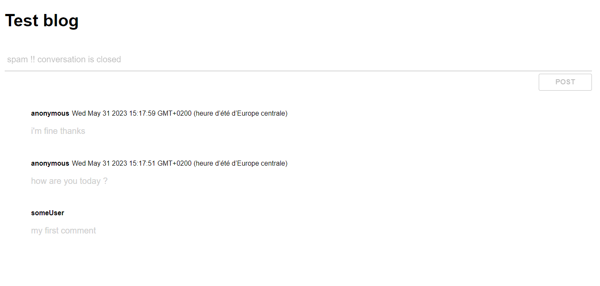

# blog with spam detection 

Un blog avec NodeJs et Express qui intègre une solution d'intelligence artificielle pour une détection de messages douteux (spams), en anglais.  

Le tchat utilise socket.io. Les spams sont détectés côté client avec un modèle TensorFlow.js entraîné par Jason Mayes, lead Developer Advocate for TensorFlow.js, hébergé par google.

